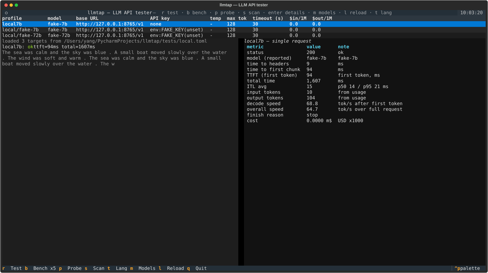
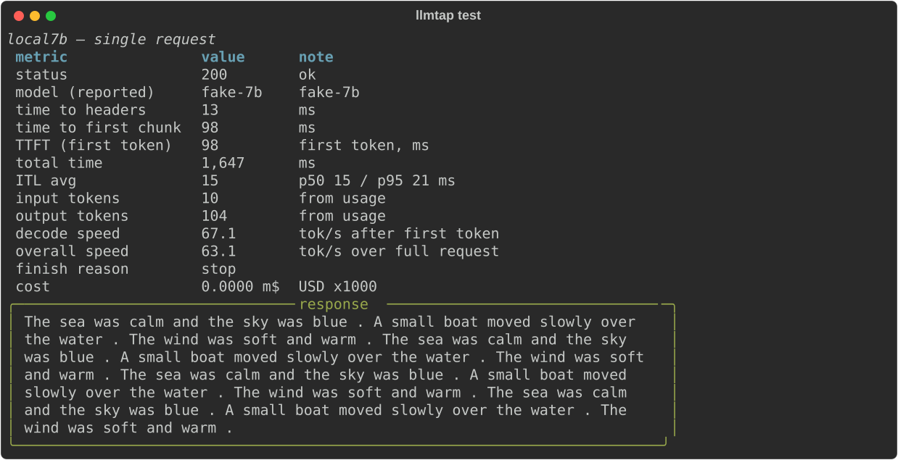
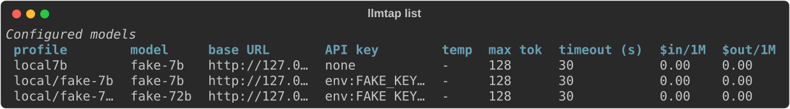
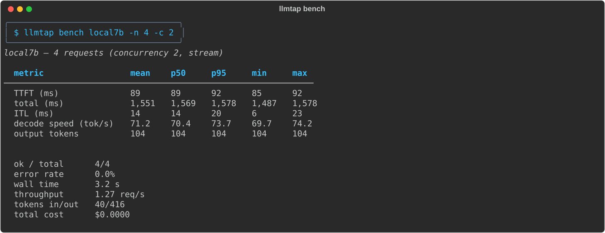
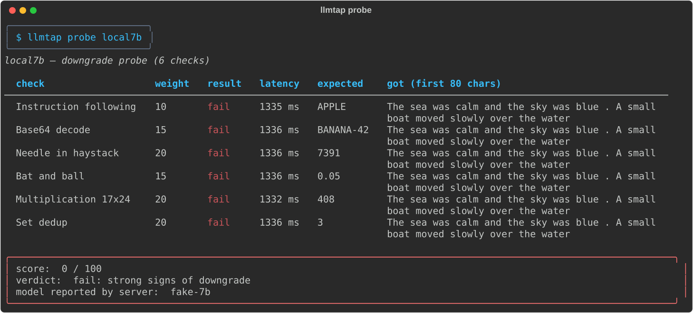
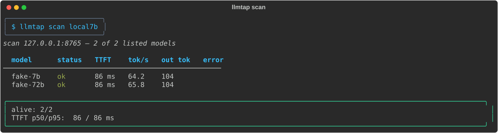

# llmtap

**Terminal tester for LLM APIs.** Measure TTFT, throughput and token stats. Probe for model downgrade. Scan relay stations. One tool, any OpenAI-compatible endpoint.

[](https://github.com/USERNAME/llmtap/actions/workflows/ci.yml)
[](https://pypi.org/project/llmtap/)
[]()
[]()
[](README.zh-CN.md)



## Why

You pay for `claude-opus-4.6` on a relay. Is the relay really serving that model? Is it fast? Which of your five API keys has the best TTFT tonight? `llmtap` answers these from the terminal. No dashboard, no signup, no data leaving your machine.

## Features

- **Latency test** — TTFT, time to first chunk, total time, inter-token latency (ITL p50/p95).
- **Throughput stats** — decode speed (tok/s), overall speed, input/output tokens, usage-aware.
- **Load bench** — N requests with configurable concurrency. Mean / p50 / p95 / min / max / stdev.
- **Downgrade probe** — 6 fixed English checks, regex-scored, no judge model. Score 0-100.
- **Relay scan** — discover every model on an endpoint via `GET /models`, test each for status and TTFT.
- **Cost estimate** — optional per-model pricing in the config, cost per request and per run.
- **TUI** — full config of all models in one table, live tok/s while streaming, stats panel.
- **Two languages** — English and Chinese UI, switch any time with `t` in the TUI or `LLMTAP_LANG`.
- **Works everywhere** — OpenAI, DeepSeek, Moonshot, Qwen, OpenRouter, Ollama, LM Studio, vLLM, or any relay.

## Install

Python 3.10+.

```bash
uv tool install llmtap   # recommended
# or
pipx install llmtap
pip install llmtap
```

From source:

```bash
git clone https://github.com/USERNAME/llmtap && cd llmtap
uv venv && uv pip install -e .
uv run llmtap --help
```

## Quick start — no config needed

```bash
llmtap test https://api.deepseek.com/v1 -k sk-xxx -m deepseek-chat   # or
llmtap test https://api.deepseek.com/v1 -k sk-xxx                    # picks a model
llmtap scan https://some-relay.com/v1 -k sk-xxx                      # scan every model
llmtap test http://127.0.0.1:11434/v1 -m qwen2.5:7b                  # local Ollama
```

A bare URL works as the first argument. `-m` is optional: when you omit it,
llmtap lists the endpoint models and asks you to pick one. Keys come from `-k`,
`--api-key-env NAME`, `$LLMTAP_API_KEY` or `$OPENAI_API_KEY`.

Save an endpoint for later, no TOML editing:

```bash
llmtap init                              # create ~/.config/llmtap/config.toml
llmtap add deepseek -u https://api.deepseek.com/v1 -k sk-xxx
llmtap test deepseek
```

When you omit PROFILE, llmtap uses the only configured profile, else the
`[defaults] profile` entry, else it asks you to pick.



## Config

Search order: `--config`, `$LLMTAP_CONFIG`, `./llmtap.toml`, `~/.config/llmtap/config.toml`. Full example: [examples/config.toml](examples/config.toml).

```toml
[defaults]
prompt = "Count from 1 to 20 slowly."
max_tokens = 512
temperature = 0.7
profile = "deepseek"              # used when PROFILE is omitted

[profiles.deepseek]                # one endpoint, one model
base_url = "https://api.deepseek.com/v1"
api_key_env = "DEEPSEEK_API_KEY"
model = "deepseek-chat"

[profiles.kimi]                    # one endpoint, several models
base_url = "https://api.moonshot.cn/v1"
api_key_env = "MOONSHOT_API_KEY"
models = ["kimi-k2-0905-preview", "moonshot-v1-8k"]

[pricing."deepseek-chat"]          # optional, USD per 1M tokens
input = 0.27
output = 1.10
```

With `models`, profiles expand to `kimi/kimi-k2-0905-preview` etc. Unique prefixes work on the command line: `llmtap test kimi/k2`.



## Commands

| Command | What it does |
|---|---|
| `llmtap` | open the TUI (shows help when no config exists) |
| `llmtap init` | create `~/.config/llmtap/config.toml` |
| `llmtap add NAME -u URL [-k KEY] [-m MODEL]` | append a profile to the config |
| `llmtap list` | table of every configured model with every setting |
| `llmtap show PROFILE` | full config of one profile |
| `llmtap models PROFILE` | call `GET /models`, list endpoint model ids |
| `llmtap test PROFILE` | one request, all metrics, response preview |
| `llmtap bench PROFILE -n 10 -c 2` | load bench with full statistics |
| `llmtap bench --all` | bench every profile, comparison table |
| `llmtap probe PROFILE` | downgrade probe, 6 checks, score 0-100 |
| `llmtap scan PROFILE` | scan every model on the endpoint |
| `llmtap tui` | interactive TUI |

PROFILE can be a profile name, a unique prefix, or a bare URL. Common options: `-u` URL, `-m` model, `-k` key, `-p` prompt, `--max-tokens`, `--temperature`, `--no-stream`, `--full`.



## Metrics

| Metric | Meaning |
|---|---|
| time to headers | request sent to response headers received |
| time to first chunk | first SSE data chunk |
| TTFT | first token (content or reasoning). What the user waits |
| ITL | gap between two tokens. High p95 means stutter |
| decode speed | tok/s after the first token |
| overall speed | tok/s over the whole request |
| tokens in/out | from `usage` when present, else estimated (marked) |
| cost | from the optional pricing table |

## How the downgrade probe works

Six fixed English questions, each with exactly one checkable answer. No judge model — answers are matched by string and regex rules. `temperature=0`, non-stream, fixed `max_tokens`, so runs are comparable.

| Check | Weight | Pass rule |
|---|---|---|
| Instruction following (reply only APPLE) | 10 | equals APPLE after cleanup |
| Base64 decode | 15 | contains decoded text |
| Needle in haystack (4-digit code in filler) | 20 | contains the code |
| Bat and ball ($1.10 trap) | 15 | 0.05 / 5 cents |
| Multiplication 17 x 24 | 20 | exactly 408 |
| Set dedup [1,1,2,3,3,3] | 20 | exactly 3 |

Score 85+ = pass, 60-84 = suspect, below 60 = strong signs of downgrade. Any request failure (401/429/5xx/timeout) marks the run inconclusive — not scored. `--strict` exits 1 below 85 for CI.

Honest limitation: the checks are easy. Any cheap model can pass them all. A pass means "no obvious downgrade", not "this really is the flagship model".



## How the relay scan works

`GET /models` lists every model id on the endpoint. Each model gets one minimal streaming request (fixed prompt, `max_tokens=16`). The scan records status, TTFT, total time, tok/s and errors, then prints: alive count, TTFT p50/p95, dead model list. Use `--only` to filter by substring, `--limit` to cap the count, `-c` for concurrency. Endpoints that reject `temperature` or `max_tokens` (o-series) are retried with defaults.



## TUI

```bash
llmtap tui
```

| Key | Action |
|---|---|
| `r` | single test, live tok/s on the right |
| `b` | bench x5, stats table |
| `p` | downgrade probe |
| `s` | scan every model on the endpoint |
| `Enter` | full config popup |
| `m` | list endpoint models |
| `l` | reload config |
| `t` | switch language (English/Chinese) |
| `q` | quit |

## Language

English by default. Chinese when the system locale is Chinese.

```bash
export LLMTAP_LANG=zh   # or en
```

CLI `--help` text stays English. All tables, verdicts and TUI text switch.

## Offline demo

No key needed:

```bash
python scripts/fake_server.py &
export LLMTAP_CONFIG=tests/local.toml
llmtap list
llmtap test local7b
llmtap bench local7b --n 5 -c 2
llmtap probe local7b
llmtap scan local7b
llmtap tui
```

Shape the fake latency with `FAKE_TTFT_MS=200 FAKE_ITL_MS=30 python scripts/fake_server.py`.

## Comparison

| Tool | Perf stats | Downgrade probe | Relay scan | TUI | Multi-endpoint config |
|---|---|---|---|---|---|
| llmtap | yes | yes | yes | yes | yes |
| token-speed-tester | yes | no | no | no | no |
| llm-relay-tester | partial | no | yes | no | partial |
| llmprobe | no | yes | no | no | no |

## Contributing

See [CONTRIBUTING.md](CONTRIBUTING.md). Bug reports and new probe checks are welcome.

## License

MIT
