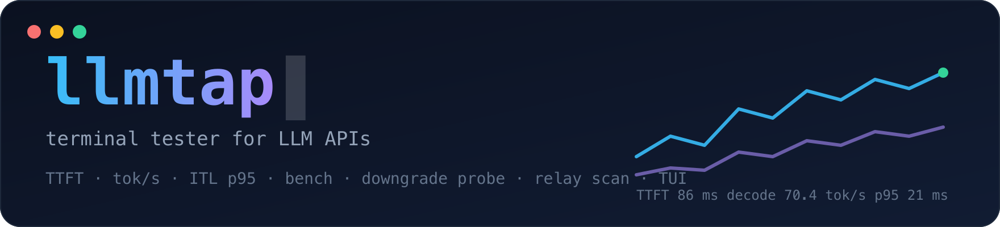
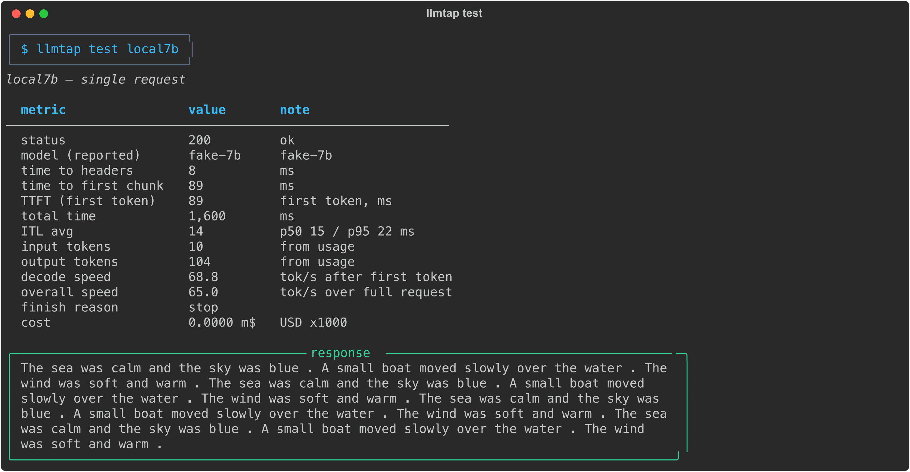
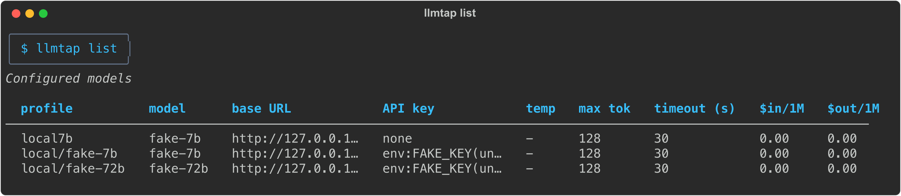
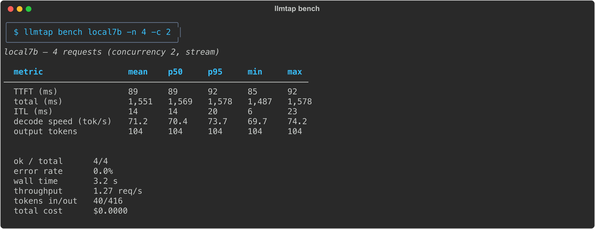
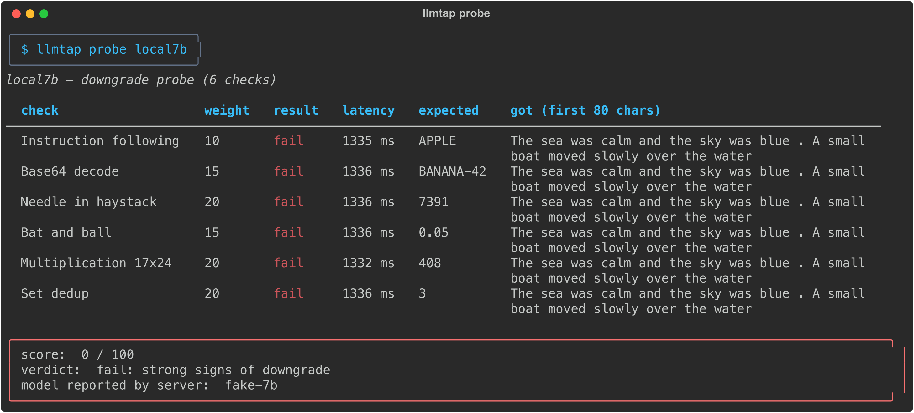
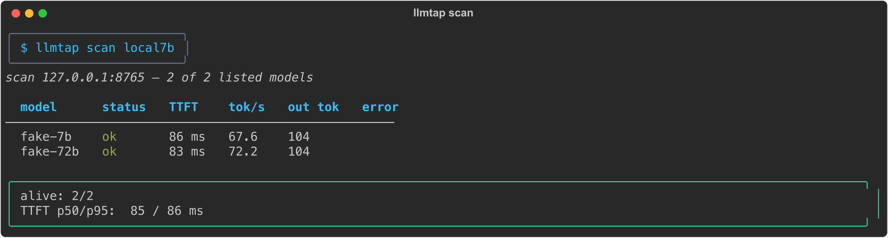
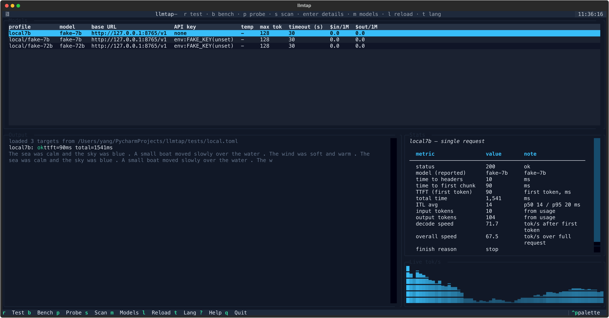

<p align="center">
  
</p>

<p align="center">
  <b>终端大模型 API 测试器。</b><br>
  测 TTFT 与吞吐。检测模型降智。扫描中转站。<br>
  一个工具,测任何 OpenAI 兼容端点。
</p>

<p align="center">
  <a href="https://github.com/Teyeray/llmtap/actions/workflows/ci.yml"></a>
  <a href="https://pypi.org/project/llmtap/"></a>
  <a href="https://pypi.org/project/llmtap/"></a>
  <a href="https://pepy.tech/project/llmtap"></a>
  <a href="LICENSE"></a>
  <a href="README.md"></a>
</p>

<p align="center">
  
</p>

<p align="center"><sub>录制自内置的假服务器。不需要任何 API key:<code>llmtap scan local7b</code></sub></p>

---

## 为什么做这个

你在中转站付费用旗舰模型。中转站真的在跑这个模型吗?今晚速度如何?手里五个 key 哪个 TTFT 最好?

`llmtap` 在终端里回答这些问题。不需要控制台,不需要注册,数据不出本机。支持 OpenAI、DeepSeek、Moonshot、Qwen、OpenRouter、Ollama、LM Studio、vLLM,以及任何 OpenAI 协议的中转。

## 功能

- **延迟**:TTFT、首包延迟、总耗时、逐 token 间隔 ITL(p50/p95)。
- **吞吐**:解码速度 tok/s、整体速度、输入/输出 token,直接取 `usage`。
- **压测**:N 个请求,可设并发。mean / p50 / p95 / min / max / stdev。
- **降智检测**:6 道固定题,规则判分,不用裁判模型。总分 0–100。
- **中转站扫描**:`GET /models` 发现全部模型,逐个测通。
- **费用**:可选的单价表,算单次与总费用。
- **TUI**:一张表看所有模型全部配置,流式时实时 tok/s。
- **双语**:中英文界面,含 `--help`。TUI 按 `t` 切换,CLI 用 `LLMTAP_LANG`。

## 安装

要求 Python 3.10 或更高。

```bash
uv tool install llmtap   # 推荐
# 或
pipx install llmtap
pip install llmtap
```

源码安装:

```bash
git clone https://github.com/Teyeray/llmtap && cd llmtap
uv venv && uv pip install -e .
uv run llmtap --help
```

## 快速开始

第一个参数可以直接写 URL。不需要配置文件。

```bash
llmtap test https://api.deepseek.com/v1 -k sk-xxx -m deepseek-chat   # 单请求
llmtap test https://api.deepseek.com/v1 -k sk-xxx                    # 自动选模型
llmtap scan https://some-relay.com/v1 -k sk-xxx                      # 扫描全部模型
llmtap test http://127.0.0.1:11434/v1 -m qwen2.5:7b                  # 本地 Ollama
```

`-m` 可省略。省略时先拉 /models 列表,再让你按编号选。密钥来源优先级:`-k`、`--api-key-env 变量名`、`$LLMTAP_API_KEY`、`$OPENAI_API_KEY`。

把端点存下来,不用手写 TOML:

```bash
llmtap init          # 生成 ~/.config/llmtap/config.toml
llmtap add deepseek -u https://api.deepseek.com/v1 -k sk-xxx
llmtap test deepseek
```

<p align="center"></p>

## 配置文件

查找顺序:`--config`、`$LLMTAP_CONFIG`、`./llmtap.toml`、`~/.config/llmtap/config.toml`。完整示例:[examples/config.toml](examples/config.toml)。

```toml
[defaults]
prompt = "Count from 1 to 20 slowly."
max_tokens = 512
temperature = 0.7
profile = "deepseek"               # 省略 PROFILE 时使用

[profiles.deepseek]                # 一个端点,一个模型
base_url = "https://api.deepseek.com/v1"
api_key_env = "DEEPSEEK_API_KEY"
model = "deepseek-chat"

[profiles.kimi]                    # 一个端点,多个模型
base_url = "https://api.moonshot.cn/v1"
api_key_env = "MOONSHOT_API_KEY"
models = ["kimi-k2-0905-preview", "moonshot-v1-8k"]

[pricing."deepseek-chat"]          # 可选:USD / 1M tokens
input = 0.27
output = 1.10
```

配置 `models` 后,profile 展开为 `kimi/kimi-k2-0905-preview` 等。命令行支持唯一前缀:`llmtap test kimi/k2`。省略 PROFILE 时:只有一个 profile 就用它;配置了 `[defaults] profile` 就用默认;否则提示选择。

<p align="center"></p>

## 命令

| 命令 | 作用 |
|---|---|
| `llmtap` | 直接进 TUI(无配置时显示帮助) |
| `llmtap init` | 生成 `~/.config/llmtap/config.toml` |
| `llmtap add 名字 -u URL [-k KEY] [-m 模型]` | 往配置追加一个 profile |
| `llmtap list` | 表格显示所有模型的全部配置 |
| `llmtap show PROFILE` | 一个 profile 的完整配置 |
| `llmtap models PROFILE` | 调 `GET /models`,列出端点模型 |
| `llmtap test PROFILE` | 单请求,全部指标,响应预览 |
| `llmtap bench PROFILE -n 10 -c 2` | 压测,完整统计 |
| `llmtap bench --all` | 压测全部 profile,输出对比表 |
| `llmtap probe PROFILE` | 降智检测,6 题,总分 0–100 |
| `llmtap scan PROFILE` | 扫描端点上全部模型 |
| `llmtap tui` | 交互界面 |

PROFILE 可以是 profile 名、唯一前缀,或直接一个 URL。常用选项:`-u` 地址,`-m` 模型,`-k` 密钥,`-p` prompt,`--max-tokens`,`--temperature`,`--no-stream`,`--full`。

<p align="center"></p>

## 指标说明

| 指标 | 含义 |
|---|---|
| time to headers | 请求发出到收到响应头 |
| time to first chunk | 第一个 SSE 数据块 |
| TTFT | 首 token 到达(含思考)。用户等待的时间 |
| ITL | 相邻 token 间隔。p95 大说明输出卡顿 |
| decode speed | 首 token 后的解码速度 tok/s |
| overall speed | 全程折算 tok/s |
| tokens in/out | 有 `usage` 用 `usage`,否则按块数估算并标注 |
| cost | 按可选单价表估算 |

## 降智检测:我付钱的模型是真的吗?

6 道固定英文题,每题有唯一可验证答案。答案用字符串与正则规则判分,不需要裁判模型。`temperature=0`,非流式,`max_tokens` 固定,结果可比。

| 题目 | 权重 | 通过规则 |
|---|---|---|
| 指令遵循(只回 APPLE) | 10 | 清理后等于 `APPLE` |
| Base64 解码 | 15 | 包含解码结果 |
| 长文本找四位验证码 | 20 | 包含验证码 |
| 球棒与球(1.10 美元陷阱) | 15 | `0.05` 或 `5 cents` |
| 乘法 17 × 24 | 20 | 精确等于 `408` |
| 集合去重 `[1,1,2,3,3,3]` | 20 | 精确等于 `3` |

总分 85 以上判通过,60–84 判可疑,60 以下判明显降智。任何请求失败(401/429/5xx/超时)判"无法判定",不给分。`--strict` 低于 85 时退出码为 1,可接入 CI。

诚实说明:题目不难,便宜小模型也可能全对。通过只说明"无明显降智",不证明就是旗舰模型。

<p align="center"></p>

## 中转站扫描:这个端点上到底有什么?

`GET /models` 拿到全部模型 id。每个模型发一条最小流式请求(固定 prompt,`max_tokens=16`)。记录状态、TTFT、总耗时、tok/s、错误。汇总输出:存活数、TTFT p50/p95、死亡模型清单。

`--only` 按子串过滤,`--limit` 限制数量,`-c` 控制并发。端点拒绝 `temperature` 或 `max_tokens` 时(o 系列)自动用默认参数重试。

<p align="center"></p>

## TUI

```bash
llmtap
```

<p align="center"></p>

| 按键 | 作用 |
|---|---|
| `r` | 单请求测试,右侧实时 tok/s |
| `b` | 连测 5 次,统计表 |
| `p` | 降智检测 |
| `s` | 扫描端点全部模型 |
| `Enter` | 完整配置弹窗 |
| `m` | 列出端点模型 |
| `?` | 显示按键说明 |
| `l` | 重载配置 |
| `t` | 切换语言(中 / 英) |
| `q` | 退出 |

## 语言

默认英文。系统语言为中文时自动切换中文。

```bash
export LLMTAP_LANG=zh   # 或 en
```

表格、结论、TUI、`--help` 输出全部随语言切换。

## 离线试用

不需要 key,不需要联网:

```bash
python scripts/fake_server.py &
export LLMTAP_CONFIG=tests/local.toml
llmtap list
llmtap test local7b
llmtap bench local7b -n 5 -c 2
llmtap probe local7b
llmtap scan local7b
llmtap
```

用 `FAKE_TTFT_MS=200 FAKE_ITL_MS=30 python scripts/fake_server.py` 调整模拟延迟。

## 与现有工具对比

| 工具 | 性能统计 | 降智检测 | 中转扫描 | TUI | 多端点配置 |
|---|---|---|---|---|---|
| **llmtap** | ✅ | ✅ | ✅ | ✅ | ✅ |
| [token-speed-tester](https://github.com/Cansiny0320/token-speed-tester) | ✅ | ❌ | ❌ | ❌ | ❌ |
| [llm-relay-tester](https://github.com/WJAnnie/llm-relay-tester) | 部分 | ❌ | ✅ | ❌ | 部分 |
| [cocodot-llmprobe](https://github.com/cocodot2026/cocodot-llmprobe) | ❌ | ✅ | ❌ | ❌ | ❌ |
| [LMeterX](https://github.com/MigoXLab/LMeterX) | ✅ | ❌ | ❌ | ❌ | ✅ |

## 贡献

欢迎提 bug、新题目和翻译。见 [CONTRIBUTING.md](CONTRIBUTING.md)。

```bash
uv venv && uv pip install -e . --group dev
uv run pytest -q                      # 对本地假服务器跑,不需要 key
uv run python scripts/make_docs.py    # 重新生成 docs/img
```

## Star 趋势

<a href="https://star-history.com/#Teyeray/llmtap&Date">
  
</a>

## License

MIT © 2026 llmtap contributors
